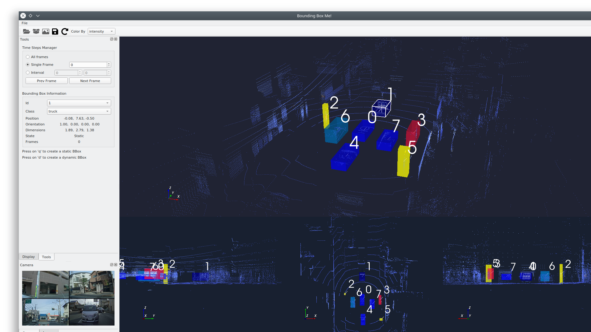
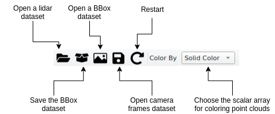
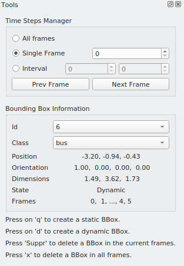
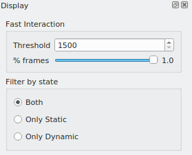

# Bounding Box Me

This tool enables you to annotate lidar frames by creating bounding boxes around objects.




## How to build ?


### Dependencies:

Bounding Box Me has the following dependencies:

- Eigen3 (tested with version 3.3.4)
- VTK (>= 8.2.0)
- yaml-cpp
- Qt (tested with 5.9, 5.11 and 5.12)

 **WARNING**:  You need to enable Qt in VTK (VTK_Group_Qt should be set)


 ## Building VTK
 ```
 git clone git@gitlab.kitware.com:vtk/vtk.git
 cd vtk
 git checkout v8.2.0
 mkdir build
 cd build
 cmake .. -DCMAKE_BUILD_TYPE=Release -DVTK_Group_Qt=ON
 make -j8
 ```


 ## Building Bounding Box Me

 ```
 git clone git@gitlab.kitware.io:ComputerVision/BoundingBoxMe.git
 cd BoundingBoxMe
 mkdir build
 cd build
 cmake .. -DCMAKE_BUILD_TYPE=Release -DVTK_DIR=path/to/VTK/build/folder
 make -j8
 ./BoundingBoxMe
 ```

## Usage


With this software, you can load lidar point clouds (in .vtp format), bounding boxes and camera frames.
Each dataset should have a .series file which lists the different elements of the dataset. This file is generated by the Magic-Hat pipeline.
The lidar dataset should also contains a .poses file generated by the SLAM.

Sample data are available in:
```
example_data/
  annotation_data/
  camera_data/
  lidar_data/
```


You can add a new bounding box using **"q"** (for a static BBox) or **"d"** (for a dynamic one).
To create a BBox around a specific point, double-click on it before pressing 'q' or 'd'.

The software has an automatic saving functionality. Once you have saved your work, it will be saved automatically every 3 minutes.

### Toolbar


### Tools tab



You can choose to display a all the frames, a single frame or the frame in a specific interval. Below, you can see the information about the currently selected bounding box. You can also edit its id and class.

You can add a new static BBox with **"q"** or a new dynamic BBox with **"d"**.
You can remove a BBox from one frame with **"Suppr"** or completely an object with **"x"**.

### Display tab



You can enable the "Fast interaction" mode. This can be useful when the lidar dataset that you are displaying is very large. It just skip some frames during rendering for a faster interaction.

You can also filter which type of bounding boxes you want to display.
